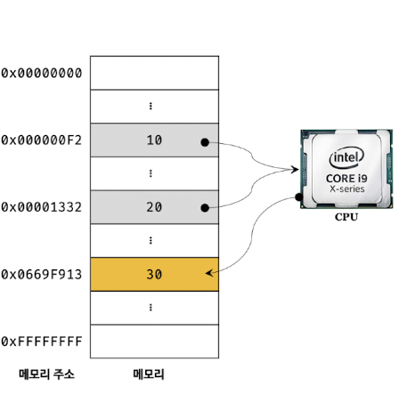
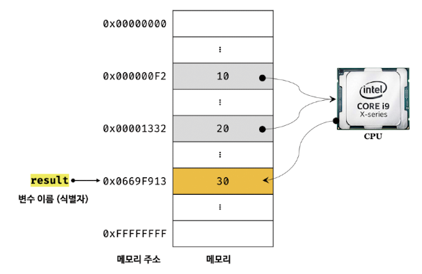

# 4장 변수

## 4.1 변수란 무엇인가?

#### 변수란 무엇인가?

변수는 하나의 값을 저장하기 위한 메커니즘이다.

즉, 그 값을 저장하기 위해 확보한 메모리 공간 자체 또는 그 마메로 공간을 식별하기 위해 붙이는 이름이다.
간단히 하면, 값의 위치를 가리키는 상징이다.

#### 그렇다면 변수는 왜 필요한가?

변수를 사용하는 이유는 이 변수를 통해 안전하게 값에 접근하기 위함이다.

개발자가 직접 메모리 주소를 통해 값을 저장하고 참조한다면 아래 이미지처럼 해당 메모리 주소를 알아야하고 참조하고 값을 할당하는 과정까지 포함하면 복잡하고 불편하기 때문에 실수가 많이 발생할 수 있다. 하지만, 변수를 활용한다면 간편하고 실수 없이 안전하게 접근이 가능해진다.

<div align="center">
  
</div>

이러한 변수를 활용하는 방법을 알아보자.

```
let userID = 1;
var userName = 'TAEHWAN'
const user = { id: 1, name: 'TAEHWAN' };
const users = [
  { id: 1, name: 'TAEHWAN' },
  { id: 2, name: 'CLEMENTE' },
 ];
```

위 코드 예시에서는 let, var, const를 이용하여 변수를 선언한다는 것을 알리고 그 뒤에 'userID'처럼 변수 이름을 지정해준 다음 저장할 값 '1'을 '=' 연산자를 통해 할당해주는 것이다.

```
let result = 10 + 20;
```

위 코드와 같은 경우에는 10 + 20을 연산하여 값 30을 생성한다. 아래 이미지처럼 이 연산을 통해 생성된 값(30)은 메모리 공간에 저장되고, 변수 이름(result)를 통해 이 값을 재사용할 수 있는 것이다. 이처럼 값이 저장된 메모리 공간에 상징적인 이름을 붙인 것이 변수이다.

이처럼 메모리 공간에 저장된 값을 식별할 수 있는 고유한 이름(result)을 변수 이름(변수명)이라 하며, 이 변수에 저장된 값(30)을 변수 값이라 한다. result에 30을 저장하는 것을 할당(대입, 저장)이라 하고, 이 값을 읽어 들이는 것을 참조라한다.

<div align="center">
  
</div>
