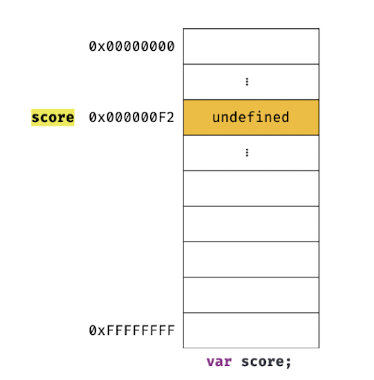

# 4장 변수

## 4.1 변수란 무엇인가? 왜 필요한가?

#### 변수란 무엇인가?

변수는 하나의 값을 저장하기 위한 메커니즘이다.

즉, 그 값을 저장하기 위해 확보한 메모리 공간 자체 또는 그 마메로 공간을 식별하기 위해 붙이는 이름이다.
간단히 하면, 값의 위치를 가리키는 상징이다.

#### 그렇다면 변수는 왜 필요한가?

변수를 사용하는 이유는 이 변수를 통해 안전하게 값에 접근하기 위함이다.

개발자가 직접 메모리 주소를 통해 값을 저장하고 참조한다면 해당 메모리 주소를 알아야하고 참조하고 값을 할당하는 과정까지 포함하면 복잡하고 불편하기 때문에 실수가 많이 발생할 수 있다. 하지만, 변수를 활용한다면 간편하고 실수 없이 안전하게 접근이 가능해진다.

이러한 변수를 활용하는 방법을 알아보자.

```
let userID = 1;
var userName = 'TAEHWAN'
const user = { id: 1, name: 'TAEHWAN' };
const users = [
  { id: 1, name: 'TAEHWAN' },
  { id: 2, name: 'CLEMENTE' },
 ];
```

위 코드 예시에서는 let, var, const를 이용하여 변수를 선언한다는 것을 알리고 그 뒤에 'userID'처럼 변수 이름을 지정해준 다음 저장할 값 '1'을 '=' 연산자를 통해 할당해주는 것이다.

```
let result = 10 + 20;
```

위 코드와 같은 경우에는 10 + 20을 연산하여 값 30을 생성한다. 이 연산을 통해 생성된 값(30)은 메모리 공간에 저장되고, 변수 이름(result)를 통해 이 값을 재사용할 수 있는 것이다. 이처럼 값이 저장된 메모리 공간에 상징적인 이름을 붙인 것이 변수이다.

이처럼 메모리 공간에 저장된 값을 식별할 수 있는 고유한 이름(result)을 변수 이름(변수명)이라 하며, 이 변수에 저장된 값(30)을 변수 값이라 한다. result에 30을 저장하는 것을 할당(대입, 저장)(assignment)이라 하고, 이 값을 읽어 들이는 것을 참조(reference)라 한다.

## 4.2 식별자

#### 식별자란 무엇인가?

변수 이름을 식별자(identifier)라고도 한다.

식별자는 어떤 값을 구별해서 식별할 수 있는 고유한 이름이다.

식별자는 메모리 공간에 저장되어 있는 어떤 값을 구별해서 식별해낼 수 있어야 하므로, 해당 메모리 공간의 주소를 기억(저장)해야 한다.

result가 값 30을 식별할 수 있었던 것처럼 식별자 result는 값 30이 저장되어 있는 메모리 주소를 기억해야하는 것으로, 식별자는 값이 저장되어 있는 메모리 주소와 매핑 관계를 갖고, 이 매핑 정보도 메모리에 저장된다.

따라서, 식별자는 변수 값이 아닌 메모리 주소를 기억하고, 우리가 메모리 주소에 붙인 이름인 것이다.

Javascript는 변수, 함수, 클래스 등의 이름과 같은 식별자를 선언(declaration)을 통해 그 존재를 알린다.

<br>

## 4.3 변수 선언

#### 변수 선언하는 방법

변수 선언(variable declaration)은 변수를 생성하는 것이다.

변수를 사용하기 위해서는 해당 변수를 선언해야하며, 선언 방법은 변수 앞에 var, let, const 키워드를 사용하는 것이다.

> 키워드? Javascript가 수행할 동작을 규정한 명령어

```
let score;
```

위 변수 선언문은 변수 이름을 등록하고 값을 저장할 메모리 공간을 확보한다.

<!-- > 이미지 #3
>
> <div align="center">
> 
> </div> -->

아직 변수(score)에 값을 할당하지 않았지만 해당 메모리 공간은 비어있지 않고 undefined라는 값이 할당되어 있다.

> undefined? Javascript에서 제공하는 원시 타입의 값(primitive value)

Javascript에서는 변수를 선언하면 Javascript 엔진이 이름을 등록해서 변수의 존재를 알아내는 선언 단계를 거쳐, 메모리 공간을 확보하고 undefined를 할당하여 초기화하는 초기화 단계를 거친다.

이 초기화 단계가 없다면 이전 애플리케이션에서 사용하던 메모리 공간에 남아있는 값(쓰레기 값)(garbage value)이 남아있어 예상치 못한 오류를 범할 수 있다.

#### 선언하지 않은 변수는?

변수를 선언하지 않는다면 당연히 해당 변수를 사용(참조)할 수 없다.

그럼에도 선언하지 않은 식별자에 접근하면 참조 에러(ReferenceError)가 발생한다.

이는 Javascript 엔진이 등록된 식별자를 찾을 수 없다는 의미로, 해당 변수를 선언하거나, 참조해서는 안 되는 것이다.

<br>

## 4.4 변수 선언의 실행 시점과 변수 호이스팅

#### 변수 선언의 실행 시점과 변수 호이스팅

```
console.log(score);
var score;
```

위 코드에서는 4.3에서 다룬 참조 에러가 발생하지 않고 undefined가 출력된다.

왜 그럴까? 그 이유는 변수 선언이 소스코드가 한 줄씩 순차적으로 실행되는 시점(런타임)이 아니라 그 이전 단계에서 먼저 실행되기 때문이다.

즉, 모든 선언문은 소스코드가 실행되기 전에 먼저 실행되는 것이다.

이처럼 어떤 선언문이 소스코드의 맨 앞에 있는 것처럼 동작하는 특징을 변수 호이스팅(variable hoisting)이라 한다.

<br>

## 4.5 값의 할당

#### 변수에 값을 할당하다

변수에 값을 할당할 때는 할당 연산자 '='를 사용한다.

```
var score = 80;
```

이 때, 위 코드처럼 우변의 값(80)을 좌변의 변수(score)에 할당하는 것이다.

4.4에서는 변수 선언문이 호이스팅 되어 런타임 이전에 실행된다고 했지만, 선언된 변수의 값을 할당하는 것도 호이스팅 되지는 않는다.

변수에 값을 할당하는 것은 해당 소스코드가 실행되는 시점인 런타임에 실행된다.

따라서, 변수를 선언한 후 값을 할당하는 것과 위 코드처럼 변수 선언과 동시에 값을 할당하는 것의 결과는 동일하다.

<br>

## 4.6 값의 재할당

#### 변수에 또 다른 값을 할당하다

이미 값이 할당되어 있는 변수에 새로운 값을 저장하고자 하면 어떻게 될까?

```
var score = 80;
score = 90;
```

위 코드에서 score 변수가 선언되며 undefined 값이 할당된다.

그 이후 80이라는 값을 재할당하고, 90을 재할당한다.

따라서, 원래 변수에 값을 할당하던 방식대로 재할당하면 된다.

하지만 재할당 할 수 없는 경우도 존재한다, 이 경우에 해당하는 값은 변수가 아닌 상수(constant)라 한다.

상수는 한 번 정해지면 변하지 않는 값이다.

> 변하지 않는 변수 const? const 키워드를 통해 변수를 선언하면 단 한 번만 값을 할당할 수 있는 변수를 선언할 수 있다. 따라서, 이 키워드를 통해 상수를 표현할 수도 있다.

4.3에서 이전 애플리케이션에서 사용하던 메모리 공간에 저장된 값이 쓰레기 값이라고 언급한 부분이 있다.

우리가 변수의 값을 재할당할 때에도 이 쓰레기 값이 발생한다.

변수에 값을 할당하거나 재할당할 때 새로운 메모리 공간을 확보하고 그 메모리 공간에 값을 저장하게 되는데, 이 때, 이전 메모리 공간은 어떤 식별자와도 연결되어 있지 않는다.

따라서 가비지 콜렉터를 통해 해당 값들은 메모리에서 자동 해제된다.

> 가비지 콜렉터? 할당된 메모리 공간을 주기적으로 검사하여 더 이상 사용되지 않는 메모리를 해제하는 기능. 이로써 메모리 누수(memory leak)를 방지한다.
