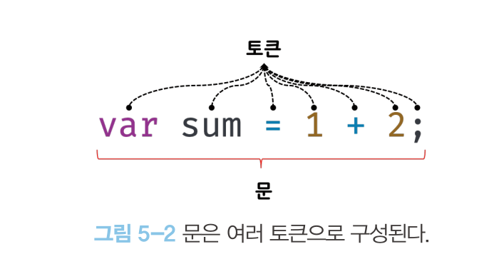

# 🎯 05 표현식과 문

[5.1 값](#1-값)  
[5.2 리터럴](#2-리터럴)  
[5.3 표현식](#3-표현식)  
[5.4 문](#4-문)  
[5.6 표현식인 문과 표현식이 아닌 문](#6-표현식인-문과-표현식이-아닌-문)

### 1. 값

**값** : 식(표현식)이 평가되어 생성된 결과  
**평가** : 식을 해석해서 값을 생성하거나 참조하는 것

```javascript
var sum = 10 + 20;
```

변수에 할당되는 '값'은 10 + 20이 아닌 평과된 결과 30이며 sum 변수가 기억하는 메모리 공간에 저장된 것도 30. 즉 할당 이전에 평가되어 값을 생성해야 함  
👉🏻 다양한 방법으로 값을 생성할 수 있는데, 가장 기본적인 방법이 **리터럴**을 사용하는 것

### 2. 리터럴

**리터럴** : 사람이 이해할 수 있는 문자 또는 약속된 기호를 사용해 값을 생성하는 표기법  
사람이 이해할 수 있는 문자 또는 미리 약속된 기호로 표기한 코드가 리터럴이다.  
자바스크립트 엔진은 코드가 실행되는 시점인 런타임에 리터럴을 평가해 값을 생성함.  
👉🏻 값을 생성하기 위해 미리 약속한 표기법

| 리터럴             | 예시                              | 비고                    |
| :----------------- | :-------------------------------- | :---------------------- |
| 정수 리터럴        | 100                               |                         |
| 부동소수점 리터럴  | 10.5                              |                         |
| 2진수 리터럴       | 0b01000001                        | 0b로 시작               |
| 8진수 리터럴       | 0o101                             | ES6에서 도입. 0o로 시작 |
| 16진수 리터럴      | ox41                              | ES6에서 도입. 0x로 시작 |
| 문자열 리터럴      | 'Hello'<br>"World"                |                         |
| 불리언 리터럴      | true<br>false                     |                         |
| null 리터럴        | null                              |                         |
| undefined 리터럴   | undefined                         |                         |
| 객체 리터럴        | { name: 'Lee', address: 'Seoul' } |                         |
| 배열 리터럴        | [ 1, 2, 3 ]                       |                         |
| 함수 리터럴        | function() {}                     |                         |
| 정규 표현식 리터럴 | /[A-Z]+/g                         |                         |

### 3. 표현식

**표현식** : 값으로 평가될 수 있는 문(statement)으로, 표현식이 평가되면 새로운 값을 생성하거나 값을 참조함

```javascript
// 100은 리터럴. 자바스크립트 엔진에 의해 평가되어 값을 생성하므로 리터럴은 그 자체로 표현식
var score = 100;

// 리터럴과 연산자로 이루어져있어도 평가되어 숫자 값 100을 생성하므로 표현식
var score = 50 + 50;

// 변수 식별자를 참조하면 변수 값으로 평가됨. 값을 생성하지 않지만 값으로 평가되므로 표현식
score; // -> 100
```

👉🏻 **값으로 평가될 수 있는 문(statement)은 모두 표현식**

### 4. 문

**문(statement)** : 프로그램을 구성하는 기본 단위이자 최소 실행 단위  
문의 집합으로 이루어진 것이 프로그램이며, 문을 작성하고 순서에 맞게 나열하는 것이 프로그래밍  
문은 문법적으로 더 이상 나눌 수 없는 코드의 기본 요소인 **토큰**으로 구성



문은 명령문이라고도 부르기에 문이 실행되면 명령이 실행되며 무슨 일인가가 일어나게 됨

- 선언문
- 할당문
- 조건문
- 반복문 등

```javascript
// 변수 선언문
var x;

// 할당문
x = 5;

// 함수 선언문
function foo() {}

// 조건문
if (x > 1) {
  console.log(x);
}

// 반복문
for (var i = 0; i < 2; i++) {
  console.log(i);
}
```

### 6. 표현식인 문과 표현식이 아닌 문

표현식과 문을 구별하는 방법

- 표현식인 문 : 값으로 평가될 수 있는 문
  - 할당문
- 표현식이 아닌 문 : 값으로 평가될 수 없는 문
  - 변수 선언문

👉🏻 변수에 할당해보면 가장 간단하게 구별 가능
