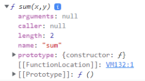

# 📂 18장 함수와 일급 객체

## 일급객체?

- 4가지 조건을 만족하면 일급객체

1. 무명의 리터럴로 생성 => 런타임에 생성이 가능
2. 변수나 자료구조(객체, 배열 등)에 저장할 수 있다.
3. 함수는 매개변수에 함수를 전달할 수 있다.
4. 함수의 반환값으로 사용할 수 있다.


```js

// 1. 무명의 리터럴
// 2. 변수나 자료구조(객체, 배열 등)에 저장
const sum = function(x,y) {
  return x+y;
}
console.log(sum) // [Function: sum]
// 런타임(할당할때)에 함수 리터럴로 평가되어 함수 객체가 생성되고 변수(sum)에 할당 됨. => 첫 번째와 두 번째 조건 만족

//  <-> 기명 표현
const subtract = function sub(x,y) {
  return x - y
}

// 4. 함수의 반환값으로 사용
function makeCounter(aux) {
  let num = 0

  return function() {
    num = aux(num);
    return num;
  }
}

// 3. 함수는 매개변수에 함수를 전달 가능
console.log(total(sum(1,2),subtract(3,4))) //2
```

## 일급객체가 되면?

- 객체와 동일하게 사용 가능합니다.
  - => 함수가 값으로 객체처럼 사용 가능하다는 뜻입니다.
  - => 값으로 사용할 수 있는 곳이라면 어디서든 리터럴로 정의 가능하고 런타임에 함수 객체로 평가가 됩니다.
- 함수형 프로그래밍이 가능합니다.
  -> 함수를 객체처럼 매개변수에 전달하거나 함수의 반환값을 사용할 수 있습니다.

## 그럼 객체랑 일급객체랑 차이점은 없나요?
- 1. 호출의 차이
  - 일반 객체는 호출하지 못하지만 일급 객체는 호출할 수 있습니다.
- 2. 함수 고유의 프로퍼티를 소유 가능

## 함수 고유의 프로퍼티는 무엇인가요?

```js
function sum (x,y) {
  return x+y;
}

console.dir(sum)
```


- arguments, caller, length, length, name prototype 프로퍼티는 함수 고유의 프로퍼티 입니다.

### arguments
- 함수 호출 시 전달된 인자들의 정보를 담고 있는 순회 가능한 유사 배열 객체 ex) Array 
- 함수 내부에서 지역 변수처럼 사용
  - 외부에선 참조할 수 없습니다.

- 🖐 잠깐, 자바스크립트는 함수의 매개변수와 인자의 개수가 일치하지 않아도 에러가 발생하지 않습니다.

```js
function sum(x,y) {
  return x+y
}
console.log(sum(1,2)) // 3
console.log(sum(1,2,3)) // 3
```
- 매개 변수의 개수 > 인자의 개수 : 인수가 전달 되지 않은 매개변수는 undefined로 초기화된 상태를 유지
- 매개 변수의 개수 < 인자의 개수 : 초과된 인수는 무시되지만, arguments 객체의 프로퍼티로 보관

#### 초과된 인수 활용하기
- 매개변수와 인자의 개수가 같지 않을 때 함수의 동작을 달리 정의할 필요가 있을 수 있습니다. => 이때 arguments 객체를 활용합니다.

- case1 - 매개변수의 개수가 불확정한 함수
  - 이러한 함수를 ***가변 인자 함수*** 라고 합니다.

```js
  function sum() {
    let result = 0;

    for(let i = 0; i<arguments.length; i++) {
      result += arguments[i];
    }
    return result
  }

  console.log(sum()) // 0
  console.log(sum(1,2)) // 3
  console.log(sum(1,2,3,4,5,6,7,8,9,10)) // 55
```
- 🕵 주의하세요
  - arguments는 유사 배열 객체이지만 배열이 아니니깐 배열 메서드 사용할 경우 에러가 발생합니다.
  - 간접 호출을 이용해서 사용해야 하는 번거러움이 있습니다
  ~~27장 배열 학습 후 추가 내용 작성 예정~~

#### Rest 파라미터의 도입
- ES6 부터
- 유사 배열 객체임으로 간접 호출 해야하는 번거로움때문에 도입
~~26장Rest파라미터 학습 후 추가 내용 작성 예정~~

### length 프로퍼티
- 함수 정의 시 선언한 매개변수의 개수를 가르킴

```js
function sum(x,y) {
  return x+y
}

function sum2(x,y,z) {
  return x+y+z
}

console.log(sum.length) // 2
console.log(sum2.length) // 3
```

#### arguments 객체 안에도 length 프로퍼티가 있는데요?
- arguments객체 안 length 프로퍼티는 ***인자***의 개수를 가리킵니다.

### name 프로퍼티

- 함수의 이름
- ES6에서 정식 표준이 되었습니다.

```js
// 기명 함수
const add = function sum(x,y) {
  return x+y
}
console.log(add.name) // sum

// 익명 함수 표현식
const 익명함수 = function() {
  return "ES5와 ES6값이 다르니 주의하세요"
}
// ES5: 빈 문자열
// ES6: 함수 객체를 가르키는 변수 이름

// 함수 선언
const print(){
  return "함수 이름을 반환합니다."
}
console.log(print.name) // print
```

~~__proto__접근자프로퍼티와 prototype프로퍼티는 아직 이해가 가지 않아 추후 학습 후 추가 예정입니다.~~
